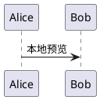

<!--
文件说明：墨记扩展 Markdown 语法说明，记录布局、媒体、公式和资源卡片格式。
作者：dingyi60(Codex)
创建时间：2026-08-05
-->

# 墨记扩展 Markdown

墨记优先使用标准 Markdown。标准语法无法表达的布局、媒体和资源卡片采用可读的扩展格式；在其他编辑器中打开时仍能看到完整原文。

所有模板都可以从“插入”菜单生成。

## GitHub 提示块

支持 `NOTE`、`TIP`、`IMPORTANT`、`WARNING` 和 `CAUTION`：

```markdown
> [!WARNING]
> 发布前请完成回归测试。
```

## 内容分栏

使用 `::: columns` 创建容器，以 `::: column` 划分列。窄窗口会自动转为纵向排列。

```markdown
::: columns
::: column
## 左栏

左侧内容

::: column
## 右栏

右侧内容
:::
```

## 折叠块

```markdown
::: details 查看详情
这里可以继续使用 **Markdown**。
:::
```

## 数学公式

数学公式由本地 KaTeX 渲染，不会上传内容。

```markdown
行内公式：$E = mc^2$

$$
\int_0^1 x^2\,dx = \frac{1}{3}
$$
```

也可以使用围栏格式：

````markdown
```math
E = mc^2
```
````

## 附件

````markdown
```attachment
title: 需求说明.pdf
url: ./需求说明.pdf
description: 评审附件
```
````

## 视频

视频支持文档相对路径、`file:`、`data:` 和 HTTP(S) 地址。为了保证文档可迁移，推荐把本地视频放在 Markdown 文件所在目录或子目录。

````markdown
```video
title: 功能演示
url: ./media/demo.mp4
```
````

## 技术资产

开源版本将技术资产展示为通用链接卡片，不读取企业内部系统数据。

````markdown
```asset
title: 接口评审
url: https://example.com/asset
description: 技术资产说明
```
````

## ZERO 文件

ZERO 文件同样使用通用链接卡片，链接可指向原型或设计稿页面。

````markdown
```zero
title: 产品原型
url: https://example.com/zero
description: ZERO 原型或设计稿
```
````

## 图表

Mermaid 始终在本地渲染；PlantUML 在首次按需安装组件后也在本地渲染。两者都不受可选插件总开关影响，也不会上传图表源码。

````markdown



````
