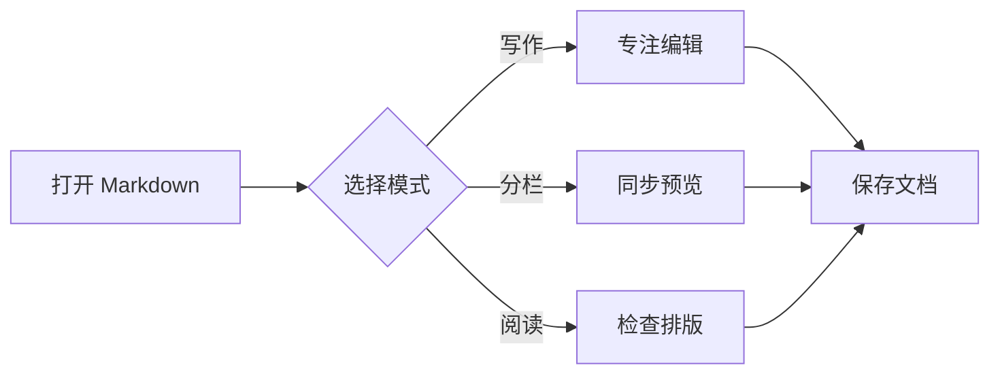
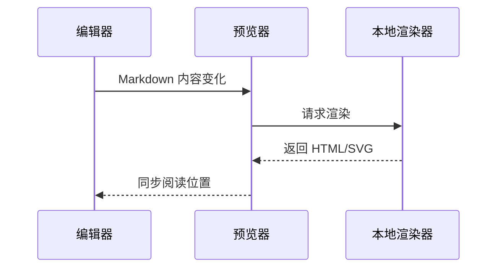
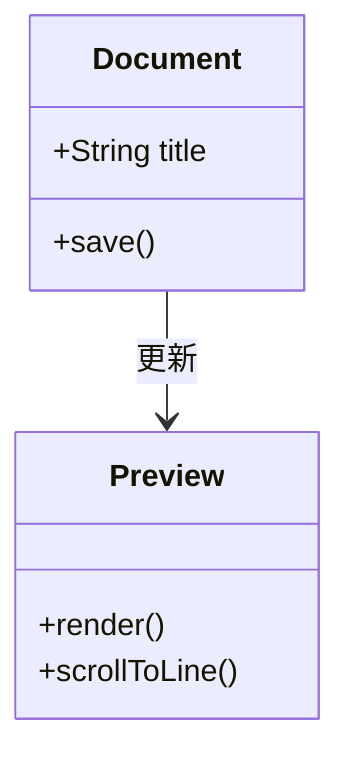
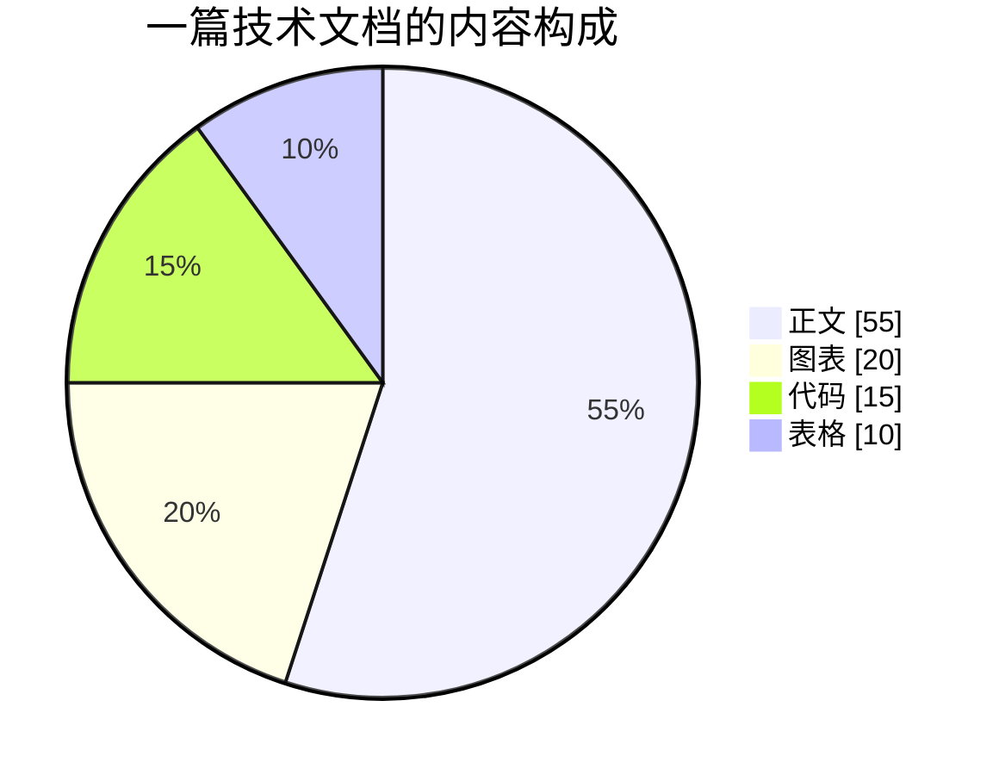
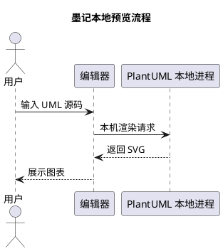
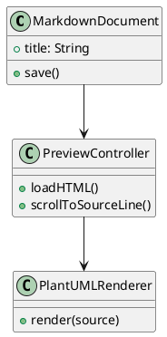
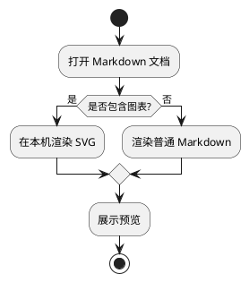

# 墨记完整功能演示

> 文档说明：集中展示墨记当前支持的标准 Markdown、GitHub 风格扩展、本地公式、离线图表、布局组件和资源卡片。
>
> 建议使用“分栏模式”查看，并分别拖动左侧编辑器和右侧预览区，观察双向滚动同步。

[TOC]

---

## 1. 标题与行内样式

# 一级标题
## 二级标题
### 三级标题
#### 四级标题
##### 五级标题
###### 六级标题

普通正文支持 **粗体文字**、*斜体文字*、~~删除内容~~ 和 `const app = "墨记"` 行内代码。

组合效果也可以用于一句话中：**重要结论**、*补充说明*、~~已经废弃~~、`Command + O`。

## 2. 链接、图片与自动链接

[访问 GitHub](https://github.com/) 是标准 Markdown 链接。

开启裸 URL 自动识别后，下面的网址会直接变成可点击链接：

https://www.markdownguide.org/

本地相对图片会从当前 Markdown 文件所在目录读取：


## 3. 列表与任务

无序列表：

- 写作模式适合专注编辑
- 分栏模式同时展示源码和预览
- 阅读模式适合检查最终排版

有序列表：

1. 打开 Markdown 文件
2. 编辑正文内容
3. 检查实时预览
4. 保存文档

任务列表：

- [x] 支持 GitHub 风格表格
- [x] 支持 Mermaid 本地渲染
- [x] 支持 PlantUML 离线渲染
- [ ] 继续完善更多社区插件

## 4. 引用与连续段落

> Markdown 的目标是让纯文本本身也保持清晰可读。
>
> 这是同一个引用块中的第二段，不应该额外显示 `>` 字符。
>
> **引用中也支持行内样式** 和 `code`。

## 5. GitHub 提示块

> [!NOTE]
> NOTE 适合展示补充信息和背景说明。

> [!TIP]
> TIP 适合展示更高效的操作建议。

> [!IMPORTANT]
> IMPORTANT 适合展示用户必须注意的关键内容。

> [!WARNING]
> WARNING 适合展示可能产生风险的操作。

> [!CAUTION]
> CAUTION 适合展示不可逆操作或严重风险。

## 6. 表格与对齐

| 功能 | 支持情况 | 渲染位置 | 说明 |
| :--- | :---: | ---: | --- |
| 标准 Markdown | 已支持 | 本地 | 标题、列表、引用、链接等 |
| Mermaid | 已支持 | 本地 | JavaScript 运行库生成 SVG |
| PlantUML | 已支持 | 本地 | 首次按需下载 Java 运行时组件后生成 SVG |
| 数学公式 | 已支持 | 本地 | KaTeX 生成排版结果 |

表格内容支持 **粗体**、`行内代码` 和 [链接](https://example.com)。转义竖线可以写成 `A \| B`。

## 7. 代码块

Swift 代码块：

```swift
struct DocumentSummary {
    let title: String
    let wordCount: Int

    var description: String {
        "\(title)：\(wordCount) 字"
    }
}
```

JavaScript 代码块：

```javascript
const renderPreview = async (markdown) => {
  const html = await renderer.render(markdown);
  return sanitize(html);
};
```

缩进代码块：

    git clone https://example.com/moji.git
    cd moji
    ./dev.sh

## 8. 数学公式

行内公式会与正文保持同一基线，例如质能方程 $E = mc^2$ 和欧拉恒等式 $e^{i\pi} + 1 = 0$。

块级公式：

$$
\int_0^1 x^2\,dx = \frac{1}{3}
$$

矩阵公式：

```math
\begin{bmatrix}
1 & 2 \\
3 & 4
\end{bmatrix}
\begin{bmatrix}
x \\
y
\end{bmatrix}
=
\begin{bmatrix}
5 \\
11
\end{bmatrix}
```

## 9. Mermaid 本地图表

### 9.1 流程图



### 9.2 时序图



### 9.3 类图



### 9.4 饼图



## 10. PlantUML 离线图表

### 10.1 时序图



### 10.2 类图



### 10.3 活动图



## 11. 内容分栏

::: columns
::: column
### 左栏：需求

- 完全本地预览
- 清晰的 Git 风格排版
- 编辑与预览双向同步
- 支持扩展插件

::: column
### 右栏：实现

1. Swift 原生文档窗口
2. WebKit 预览页面
3. Mermaid 与 KaTeX 本地脚本
4. PlantUML 与 Temurin 本地运行时
:::

## 12. 折叠内容

::: details 点击展开实现说明
折叠区域适合承载较长的补充信息、排查步骤或默认不需要阅读的技术细节。

这里仍然可以使用 **粗体**、*斜体*、`代码` 和普通段落。
:::

## 13. 资源卡片

### 13.1 附件

```attachment
title: 墨记产品需求说明.pdf
url: ./墨记产品需求说明.pdf
description: 本地附件卡片演示，文件不存在时仍可检查卡片样式
```

### 13.2 技术资产

```asset
title: Markdown 语法规范
url: https://www.markdownguide.org/basic-syntax/
description: 通用技术资料链接卡片
```

### 13.3 ZERO 文件

```zero
title: 墨记产品原型
url: https://example.com/moji-prototype
description: 原型或设计稿链接卡片
```

## 14. 视频

下面使用公开测试视频展示原生播放控件，视频本身需要网络加载；本地文件可以把 `url` 改成相对路径。

```video
title: HTML5 视频控件演示
url: https://interactive-examples.mdn.mozilla.net/media/cc0-videos/flower.mp4
```

## 15. 分隔线与长文滚动同步

---

下面的章节用于验证长文档滚动定位。请在分栏模式中拖动任意一侧，另一侧应滚动到语义接近的位置。

### 15.1 设计原则

墨记把文档内容放在界面中心，工具栏只保留高频操作。预览主题、内容宽度和插件管理集中放在设置中，避免打断日常写作。

### 15.2 本地优先

Markdown 文档、Mermaid、PlantUML 和数学公式都可以在本机处理。PlantUML 运行时启用安全配置，禁止图表通过包含指令读取其他本地文件或访问网络。

### 15.3 阅读体验

默认 Git 风格适合技术文档，表格、代码、引用和任务列表保持熟悉的视觉结构。还可以从设置中切换清爽、纸张、夜间、暖色和手稿主题。

### 15.4 编辑体验

写作、分栏和阅读三种模式分别面向专注输入、实时校对和纯阅读。菜单、快捷键、查找、拼写检查与文件打开遵循 macOS 使用习惯。

### 15.5 插件能力

目录和代码复制属于可选内置插件，用户也可以安装本地 JavaScript 脚本扩展预览。Mermaid、PlantUML 和数学公式属于核心格式能力，不受插件总开关影响。

### 15.6 演示结束

如果这一段能够与左侧源码保持大致对应，说明长文档双向滚动同步正在工作。现在可以回到文档顶部，切换不同预览主题继续检查全部组件。
