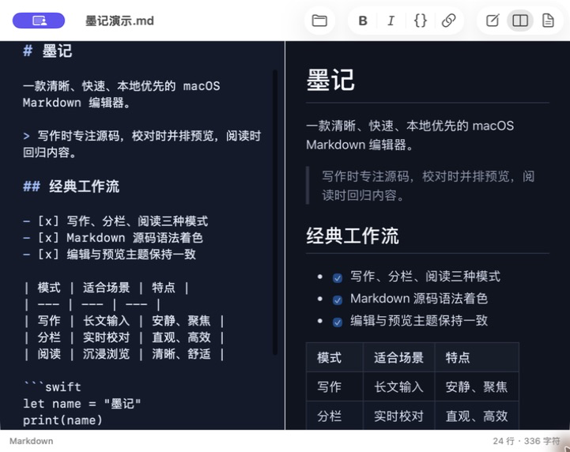
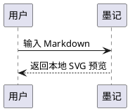

<!--
文件说明：墨记开源项目说明，介绍产品能力、构建方式、架构和贡献入口。
作者：Codex
创建时间：2026-07-29
-->

<p align="center">
  
</p>

<h1 align="center">墨记</h1>

<p align="center">
  清晰、快速、本地优先的 macOS Markdown 编辑与阅读工具
</p>

<p align="center">
  macOS 11.0+ · Swift + AppKit · 当前版本 1.0.0（1） · MIT License
</p>

墨记使用 Swift（苹果现代开发语言）、AppKit（macOS 原生界面框架）和 WKWebView（网页预览控件）构建。它保留经典 Markdown 工作流，同时提供本地图表、数学公式、扩展内容块和预览插件能力，不依赖账号或云服务。



## 核心能力

| 分类 | 能力 |
| --- | --- |
| 写作与阅读 | 写作、分栏、阅读三种模式；Markdown 语法着色；原生查找、拼写检查、撤销与重做 |
| 实时预览 | 默认 GitHub 风格排版，支持清爽、纸张、夜间、暖色和手稿主题，可调整阅读宽度 |
| 双向滚动 | 编辑器与预览按 Markdown 源行对应滚动，图表和公式异步渲染后仍保持当前章节 |
| 标准语法 | 标题、列表、引用、链接、图片、代码块、表格、任务列表和删除线 |
| 扩展语法 | GitHub 提示块、内容分栏、折叠块、附件、视频、技术资产和 ZERO 链接卡片 |
| 本地图表 | Mermaid、PlantUML 和 KaTeX 数学公式均在本机渲染，断网状态下仍可使用 |
| 原生体验 | macOS 菜单、工具栏、快捷键、自动保存、文件关联和固定高度的滚动设置窗口 |
| 插件系统 | 内置文档目录与代码复制，可安装本地 `.js` 预览插件并单独启停 |
| 本地优先 | 文档、图表源码和公式不上传；插件无法调用墨记原生接口，预览页主动网络访问受限 |

完整功能示例见 [Examples/墨记完整功能演示.md](Examples/墨记完整功能演示.md)。扩展语法说明见 [Docs/ExtendedMarkdown.md](Docs/ExtendedMarkdown.md)。

## 本地图表

Mermaid 使用标准代码围栏：

````text

````

PlantUML 支持 `plantuml` 与 `puml` 代码围栏。墨记随应用分发 PlantUML 和 Temurin JRE（Java 运行环境），无需另行安装 Java：

````text

````

数学公式使用本地 KaTeX（网页数学排版引擎），支持 `$...$`、`$$...$$` 和 `math` 代码围栏。

## 系统要求

- macOS 11.0 或更高版本
- Xcode 15 或更高版本；推荐使用当前稳定版 Xcode
- Apple Silicon 或 Intel Mac

## 本地开发

克隆仓库后运行：

```bash
./dev.sh
```

脚本会构建 Debug（调试版）并启动最新应用。也可以直接用 Xcode 打开工程：

```bash
open InkMark.xcodeproj
```

命令行构建：

```bash
xcodebuild \
  -project InkMark.xcodeproj \
  -scheme InkMark \
  -configuration Debug \
  -destination 'generic/platform=macOS' \
  -derivedDataPath DerivedData \
  CODE_SIGNING_ALLOWED=NO \
  build
```

项目没有 CocoaPods（旧依赖管理工具）或 Ruby 依赖。仓库已包含 Mermaid、KaTeX、PlantUML 和双架构 Temurin JRE，首次克隆无需额外安装 Java。

## 自动测试

运行 Markdown 渲染冒烟测试（覆盖主要流程的轻量自动测试）：

```bash
xcrun swiftc \
  InkMark/Sources/Core/Markdown/ModernMarkdownRenderer.swift \
  Tests/RendererSmokeTests/main.swift \
  -o /tmp/moji-renderer-tests

/tmp/moji-renderer-tests
```

运行真实 WKWebView 预览测试，验证 Mermaid、PlantUML、KaTeX 和双向滚动映射：

```bash
xcrun swiftc \
  -framework AppKit \
  -framework WebKit \
  InkMark/Sources/Core/Markdown/ModernMarkdownRenderer.swift \
  InkMark/Sources/Core/Preferences/MojiPreferences.swift \
  InkMark/Sources/Core/Plugins/MojiPluginManager.swift \
  InkMark/Sources/Core/Diagram/MojiPlantUMLRenderer.swift \
  InkMark/Sources/Features/Preview/Modern/ModernPreviewViewController.swift \
  Tests/PreviewRuntimeTests/main.swift \
  -o /tmp/moji-preview-runtime-tests

/tmp/moji-preview-runtime-tests \
  "$PWD/Examples/墨记完整功能演示.md"
```

## 打包安装包

运行发布脚本可构建同时支持 Apple Silicon 与 Intel 的通用架构应用，并生成 DMG（macOS 磁盘映像安装包）：

```bash
./package.sh
```

脚本会依次执行 Release（发布版）构建、本地临时签名、签名校验和 DMG 校验。产物保存在 `outputs/`，命令末尾会输出 SHA-256（文件完整性摘要）。

## 项目结构

```text
InkMark/
├── InkMark/
│   ├── Sources/App/             # 应用生命周期与文档窗口
│   ├── Sources/Core/            # Markdown、图表、设置和插件
│   ├── Sources/Features/        # 编辑器与预览功能
│   ├── Resources/PlantUML/      # PlantUML 与双架构 Java 运行时
│   └── Images.xcassets/         # 应用图标资源
├── InkMark.xcodeproj/           # Xcode 工程与共享 Scheme
├── Docs/                        # 架构、扩展语法和插件开发文档
├── Examples/                    # 完整演示文档、资源与插件示例
├── Tests/
│   ├── RendererSmokeTests/      # Markdown 渲染冒烟测试
│   └── PreviewRuntimeTests/     # 图表与滚动同步运行时测试
├── LICENSES/                    # 第三方项目许可证
├── dev.sh                       # 本地开发入口
└── package.sh                   # 本地发布入口
```

## 文档

- [架构说明](Docs/Architecture.md)
- [扩展 Markdown 语法](Docs/ExtendedMarkdown.md)
- [插件开发指南](Docs/PluginDevelopment.md)
- [阅读时间插件示例](Examples/Plugins/reading-time.js)
- [变更日志](CHANGELOG.md)

用户插件可以在“设置 → 插件 → 添加”中安装。Mermaid、PlantUML 和数学公式属于核心 Markdown 能力，不受可选插件总开关影响。

## 贡献与安全

提交改动前请阅读 [CONTRIBUTING.md](CONTRIBUTING.md)。问题报告需要包含 macOS 版本、应用版本、复现步骤和预期结果；界面问题建议附带截图。

安全问题请按照 [SECURITY.md](SECURITY.md) 处理，不要在公开议题中披露尚未修复的漏洞。

## 许可证

墨记以 [MIT License](LICENSE) 开源。

随应用分发的第三方运行库及许可证详见 [THIRD_PARTY_NOTICES.md](THIRD_PARTY_NOTICES.md) 和 [LICENSES](LICENSES)。
